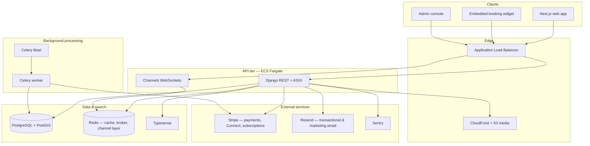

<p align="center">
  <strong>ClassEasily</strong><br />
  <em>Backend API &amp; platform services</em>
</p>

<p align="center">
  <a href="#overview">Overview</a> ·
  <a href="#architecture">Architecture</a> ·
  <a href="#what-makes-this-hard">Complexity</a> ·
  <a href="#domain-surface-area">Domain</a> ·
  <a href="#engineering-highlights">Highlights</a> ·
  <a href="#operations">Operations</a>
</p>

<p align="center">
  
  
  
  
  
  
</p>

---

## Overview

**ClassEasily** is a full-stack booking and CRM platform aimed at small experience businesses—studios, instructors, and hosts who sell classes, appointments, memberships, and packages. The backend is the system of record: it powers a public marketplace, a multi-tenant **embeddable booking widget**, host dashboards, guest checkout, payouts, messaging, marketing automation, and an internal admin console.

This repository is the **Django REST API**, background workers, WebSocket layer, and deployment automation. The companion **Next.js** frontend lives in a separate repo (`classeasily-frontend-next`).

> **Portfolio note:** This codebase is published to demonstrate system design and implementation depth. It is not offered as a drop-in template or supported open-source product.

---

## Architecture

At a high level, traffic flows from the web app and embedded widget into a stateless API tier; long-running and scheduled work is pushed to Celery; real-time updates use Channels over Redis; search and geo discovery use Typesense and PostGIS.



---

## What makes this hard

These are the problems the backend is built around—not a CRUD demo.

| Area | Why it is non-trivial |
|------|------------------------|
| **Two go-to-market modes** | Marketplace discovery and SEO-facing listings coexist with **white-label widget** bookings on third-party domains, each with different branding, plan gates, and fee rules. |
| **Money movement** | Stripe Connect Express onboarding, PaymentIntents, subscriptions, partial refunds, gift-card ledger + card splits, and **batch payouts** with `select_for_update`, idempotency keys, and orphan-transfer reconciliation against Stripe’s API. |
| **Scheduling truth** | Recurring schedules, capacity, waitlists, spot holds with TTL (released every few minutes), session completion → payout eligibility, and cancellation policies that drive refund percentages. |
| **Real-time UX** | In-app notifications and **conversation messaging** (typing, read receipts) over WebSockets, with REST fallbacks and email for guests without accounts. |
| **Search & place** | Typesense indexing plus geographic models (PostGIS) for explore, collections, and location-aware ranking. |
| **Marketing stack** | Scheduled campaigns and **workflow enrollments** (minute-level dispatch), separate from transactional mail, with quota and addon billing hooks. |
| **Security & tenancy** | JWT + django-allauth, granular Django permissions, widget origin allowlists, impersonation for support, audit logs, and banned-IP tooling. |
| **Operational scale of surface area** | On the order of **700+ HTTP routes**, a **5k+ line** domain model module, and dozens of bounded contexts (bookings, payouts, CRM, courses, corporate shortlists, blog, metrics). |

---

## Domain surface area

The `quickstart` app is intentionally monolithic but partitioned by view packages and tasks:

- **Public & guest** — Explore, booking checkout, guest inbox (tokenized), conversations, blog.
- **Business (host)** — Services/classes, schedules, staff, students/contacts, bookings, reviews, locations, revenue analytics, Stripe Connect, payouts export, memberships, gift cards, email branding & marketing.
- **Widget** — Config, themed embed, subscription tiers, server-side booking creation with plan/addon enforcement.
- **Admin** — Users, businesses, bookings, payments, payouts (manual trigger/retry), support tickets, widget subscriptions, revenue stats, conversations.
- **Webhooks** — Stripe (payments + Connect), Resend.
- **Tasks** — Payouts, refunds, reminders, marketing dispatch, AI-assisted content reconciliation, cache/search maintenance.

---

## Engineering highlights

### Payout pipeline

Daily payout processing groups completed, paid bookings per business, locks rows to prevent double pay, builds deterministic Stripe **idempotency keys** per batch, recovers from idempotency conflicts by listing transfers, and runs scheduled **integrity audits** (duplicate batches, temp transfer IDs, Stripe orphans vs DB).

### Booking lifecycle

Confirmed bookings transition to completed after session date; reminders respect per-business lead times and plan features; expired checkout spots are released on a short cron cadence to avoid ghost capacity.

### Widget vs marketplace

The same core `Booking` model serves both channels, but email branding, SMS gates, and subscription checks differ. Middleware and config enforce **allowed embed origins** so API keys cannot be abused from arbitrary sites.

### ASGI dual stack

HTTP is served through Django/DRF; WebSockets require ASGI (`uvicorn` / `run_asgi.py`) with Redis channel layers—documented in-repo because many Django projects stop at WSGI-only.

### Infrastructure as code

`deployment/terraform` models the production AWS topology (Fargate services, RDS, ALB, ECR pipelines, Secrets Manager integration, optional staging on EC2). Frontend static hosting is separate (Vercel); this repo owns the API/data plane.

---

## Operations

| Concern | Approach |
|---------|----------|
| **API hosting** | ECS Fargate behind ALB; separate worker service for Celery |
| **Database** | RDS PostgreSQL with PostGIS extension |
| **Cache & queues** | Redis for Django cache, Celery broker/result, Channels |
| **Search** | Typesense on Fargate + EFS (Cloud Map service discovery) |
| **Media** | S3 + CloudFront |
| **Observability** | Sentry (Django + Celery integrations) |
| **CI/CD** | GitHub Actions → ECR deploy; Terraform/CodePipeline equivalent documented under `deployment/terraform/` |

---

## Testing & quality

- **pytest** + **factory-boy** for API and task behavior (payout idempotency, Stripe webhooks, widget plans, auth flows).
- **Endpoint inventory** and perf smoke tooling under `quickstart/tests/perf/`.
- Management commands for payout reconciliation, email previews, and integrity monitoring—reflecting how ops-heavy the domain is.

---

## Repository map (selected)

```
CEBackend/           # Django project settings, Celery, ASGI routing
quickstart/          # Models, views, tasks, consumers, serializers
templates/emails/    # Transactional HTML email templates
deployment/          # Terraform, ECS task defs, docker-compose helpers
```

---

## Related repository

**Frontend:** Next.js App Router application — marketing site, host dashboard, guest flows, Stripe Elements checkout, admin UI, and widget demo. See `classeasily-frontend-next`.

---

<p align="center">
  <sub>Built as a portfolio showcase of full-stack product engineering — payments, scheduling, search, realtime, and cloud ops in one system.</sub>
</p>
